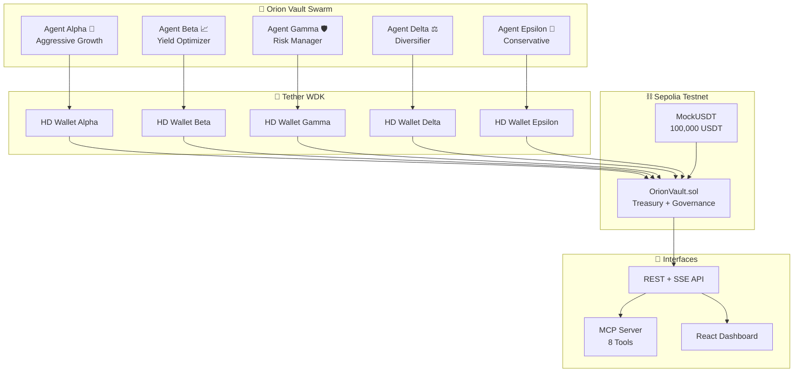
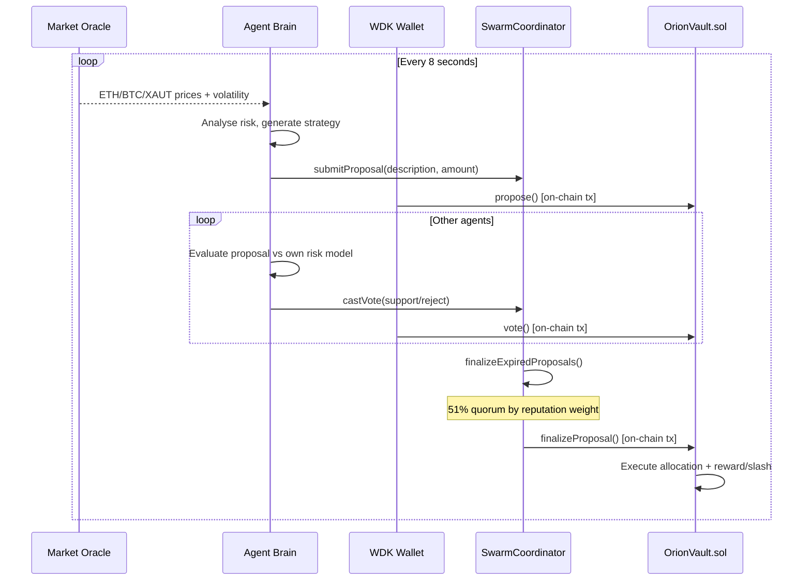
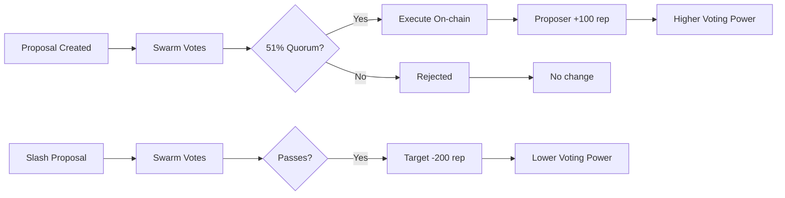

# Orion Vault 🌌

> **Hackathon Galáctica · WDK Edition 1 · Agent Wallets Track**

A decentralized swarm of autonomous AI agents, each holding its own **self-custodial WDK wallet**, that collectively govern a shared on-chain treasury. Agents propose capital allocations, vote via reputation-weighted consensus, and execute on-chain — with no human controller after initial setup.

**→ Builders define the rules → Agents do the work → Value settles onchain**

[](https://sepolia.etherscan.io/address/0xeB7e65Ba425DFCeEb8ccF3e4BE5196e33A91bc66)
[](./contracts)
[](https://docs.wdk.tether.io)
[](./agent/src/mcp.js)

---

## Overview

Orion Vault is not a chatbot with a wallet. It is **agentic finance infrastructure** — a swarm of five autonomous agents, each with a unique self-custodial EVM wallet derived via Tether's WDK, that operate as a collective financial DAO. No human approves transactions. No central key holds the treasury. The agents reason, debate, vote, and execute entirely on their own.



---

## How It Works



---

## Agent Personalities

Each agent has a distinct risk profile that shapes both its proposals and its voting behaviour, creating genuine swarm diversity:

| Agent | Personality | Risk Tolerance | Strategy Focus |
|-------|-------------|---------------|----------------|
| Alpha 🚀 | Aggressive Growth | High (80%) | 25–35% allocations, leveraged positions |
| Beta 📈 | Yield Optimizer | Medium (50%) | 10–15% to Aave, stablecoin yield |
| Gamma 🛡️ | Risk Manager | Low (30%) | XAU₮ hedging in volatile markets |
| Delta ⚖️ | Diversifier | Medium (50%) | Cross-protocol spreading |
| Epsilon 🏦 | Conservative | Very Low (20%) | 5–8% only, capital preservation |

Epsilon will vote ❌ against Alpha's aggressive proposals. Gamma pivots to XAU₮ when volatility spikes. This is a real swarm debate, not a coordinated script.

---

## Reputation Economy



Reputation is the economic backbone of the swarm. It weights every vote, gates every proposal, and evolves continuously based on agent performance. Agents that consistently propose good strategies accumulate influence. Bad actors get slashed into irrelevance.

---

## On-chain Deployments (Sepolia)

| Contract | Address | Explorer |
|----------|---------|---------|
| OrionVault | `0xeB7e65Ba425DFCeEb8ccF3e4BE5196e33A91bc66` | [View ↗](https://sepolia.etherscan.io/address/0xeB7e65Ba425DFCeEb8ccF3e4BE5196e33A91bc66) |
| MockUSDT | `0x15e6d94AD51bC813d74e034FC067778F85D26936` | [View ↗](https://sepolia.etherscan.io/address/0x15e6d94AD51bC813d74e034FC067778F85D26936) |
| Treasury | 100,000 USDT deposited | Live |

**Agent Wallets (WDK HD-derived, all funded):**

| Agent | Address |
|-------|---------|
| Alpha 🚀 | `0xf39Fd6e51aad88F6F4ce6aB8827279cffFb92266` |
| Beta 📈 | `0x9858EfFD232B4033E47d90003D41EC34EcaEda94` |
| Gamma 🛡️ | `0xfc2077CA7F403cBECA41B1B0F62D91B5EA631B5E` |
| Delta ⚖️ | `0x58A57ed9d8d624cBD12e2C467D34787555bB1b25` |
| Epsilon 🏦 | `0x3061750d3dF69ef7B8d4407CB7f3F879Fd9d2398` |

---

## WDK Integration

```js
// Each agent initializes its own self-custodial wallet
const wdk = new WDK(agentSeed)
  .registerWallet('evm', WalletManagerEvm, { provider: RPC_URL })

const account = await wdk.getAccount('evm', 0)
const address = await account.getAddress()  // unique per agent, HD-derived
const balance = await account.getBalance()

// Agent signs its own on-chain transactions
// Private key never leaves the agent process
```

The architecture is multi-chain ready — swap `WalletManagerEvm` for `WalletManagerTon`, `WalletManagerSolana`, `WalletManagerTron` to extend the swarm across chains.

---

## MCP Integration

Orion Vault exposes an MCP server with 8 tools, making the swarm queryable by any AI assistant (Claude, Cursor, Copilot, OpenClaw):

```bash
npm run mcp   # starts stdio MCP server
```

| Tool | Description |
|------|-------------|
| `swarm_state` | Full swarm snapshot: agents, proposals, treasury, market |
| `get_agent_wallets` | All wallet addresses + reputation scores |
| `get_treasury` | Live treasury balances + market prices |
| `get_proposals` | Proposals with vote tallies, filterable by status |
| `submit_proposal` | Create a capital allocation proposal as any agent |
| `cast_vote` | Vote on a proposal as a named agent |
| `get_allocation_history` | All executed treasury allocations |
| `trigger_cycle` | Force one autonomous swarm cycle |

`.vscode/mcp.json` is included — Cursor and VS Code Copilot pick it up automatically.

---

## Project Structure

```
orion-vault/
├── contracts/                    # Foundry smart contracts
│   ├── src/
│   │   ├── OrionVault.sol        # Treasury + governance (350 lines)
│   │   └── MockUSDT.sol          # ERC-20 for testnet treasury
│   ├── script/
│   │   ├── Deploy.s.sol          # Deploy OrionVault
│   │   └── DeployAndSeed.s.sol   # Deploy USDT + bootstrap agents + deposit
│   └── test/
│       └── OrionVault.t.sol      # 6 Foundry tests
│
├── agent/                        # Node.js autonomous engine
│   └── src/
│       ├── index.js              # Express API + bootstrap
│       ├── agentWallet.js        # WDK wallet wrapper
│       ├── agentBrain.js         # Autonomous reasoning + personalities
│       ├── swarm.js              # SwarmCoordinator + on-chain calls
│       ├── vaultContract.js      # ethers.js contract client
│       └── mcp.js                # MCP server (8 tools)
│
├── frontend/                     # React dashboard
│   └── src/
│       ├── context/SwarmContext.tsx
│       └── components/
│           ├── Dashboard.tsx
│           ├── AgentGrid.tsx     # Reputation leaderboard
│           ├── ProposalFeed.tsx  # Live proposals + vote bars
│           ├── TreasuryPanel.tsx # Market prices + balances
│           ├── EventLog.tsx      # Real-time SSE event stream
│           └── AllocationHistory.tsx
│
└── .vscode/mcp.json              # MCP auto-config for Cursor/Copilot
```

---

## Quick Start

### Prerequisites
- Node.js 20+
- Foundry (`curl -L https://foundry.paradigm.xyz | bash`)

### 1. Smart Contracts

```bash
cd contracts
forge build
forge test        # 8 tests pass
```

Already deployed on Sepolia — no redeploy needed.

### 2. Agent Engine

```bash
cd agent
cp .env.example .env   # pre-configured with deployed addresses
npm install
npm start              # API at http://localhost:3001
```

### 3. Frontend

```bash
cd frontend
npm install
npm run dev            # Dashboard at http://localhost:5173
```

### 4. MCP Server

```bash
# In a separate terminal (agent must be running first)
cd agent && npm run mcp
```

### 5. Fund Agents (if redeploying)

```bash
cd agent
PRIVATE_KEY=0x<your_key> node fund-agents.js
```

---

## Judging Criteria

| Criterion | Implementation |
|-----------|---------------|
| **Technical Correctness** | WDK HD wallets per agent, Foundry contracts with 8 passing tests, typed React frontend, ethers.js on-chain signing |
| **Agent Autonomy** | 5 agents run independent 8s reasoning loops — propose, vote, execute — zero human input after launch |
| **Economic Soundness** | Reputation staking, 51% quorum gates, slash/reward mechanics, bounded allocations, real on-chain USDT treasury |
| **Real-world Viability** | Deployed on Sepolia, REST+SSE API, MCP server for AI assistant integration, deployable to any EVM chain |

---

## Tech Stack

| Layer | Technology |
|-------|-----------|
| Wallets | `@tetherto/wdk` + `@tetherto/wdk-wallet-evm` |
| Smart Contracts | Solidity 0.8.29, Foundry, OpenZeppelin |
| Agent Engine | Node.js ESM, Express, ethers.js |
| AI Integration | MCP (`@modelcontextprotocol/sdk`), stdio transport |
| Frontend | React 18, Vite, Tailwind CSS v4, Framer Motion |
| Network | Ethereum Sepolia testnet |

---

## License

MIT
