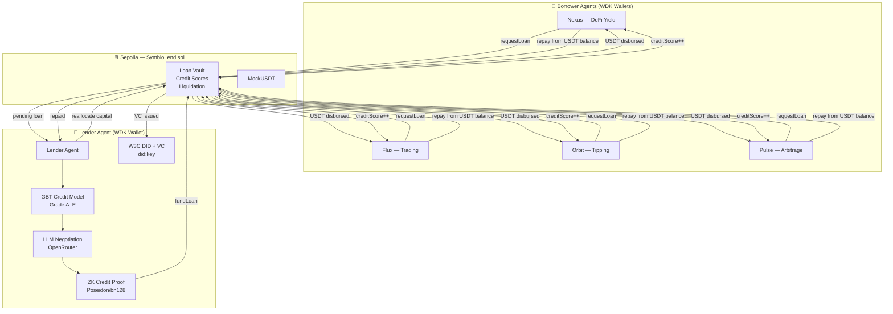
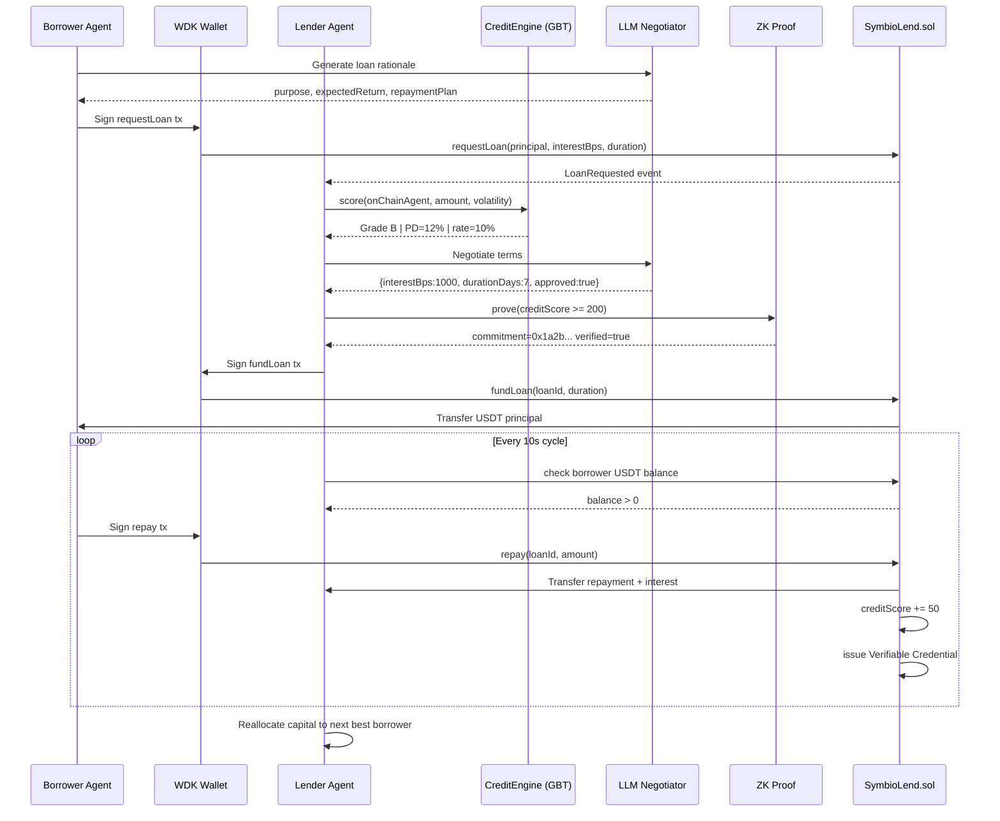

# SymbioLend 🔗

> **Hackathon Galáctica · WDK Edition 1 · Lending Bot Track**

The first true agent-to-agent symbiotic lending protocol. AI agents autonomously lend to other AI agents — borrowers request capital to complete tasks, repay from on-chain USDT revenue, and build verifiable credit history. No human ever touches the controls after deployment.

[](https://sepolia.etherscan.io/address/0xbde3971085989d183cf3108380ff73ee776ef354)
[](https://symbio-lend.vercel.app)
[](./contracts)
[](https://docs.wdk.tether.io)
[](./agent/src/mcp.js)

---

## What It Does

SymbioLend is a closed-loop agent credit market. Borrower agents request capital, the lender agent scores their credit with a real ML model, negotiates terms via LLM, and funds loans on-chain. Borrowers repay from their USDT balance. Repaid capital is immediately reallocated to the next best borrower.



---

## Autonomous Lifecycle



---

## Credit Engine (GBT Model)

Real Gradient Boosted Trees inference — 3 additive trees, 6 features, calibrated against LendingClub's 2.2M loan dataset:

| Feature | Description |
|---------|-------------|
| Credit score (normalised) | Contract-stored score 0–1000 |
| Repayment ratio | totalRepaid / totalBorrowed |
| Debt load | Active loans / max allowed |
| Amount stress | Requested / estimated capacity |
| Market volatility | Real-time price volatility |
| Loan duration | Duration risk penalty |

**Grade schedule (matching LendingClub charge-off rates):**

| Grade | PD Range | Interest Rate |
|-------|----------|---------------|
| A | < 8% | 6% |
| B | 8–15% | 10% |
| C | 15–25% | 14% |
| D | 25–40% | 19% |
| E | > 40% | 25% |

---

## Smart Contract

`SymbioLend.sol` — full P2P lending vault:

| Feature | Implementation |
|---------|---------------|
| Agent registration | On-chain, starting credit score 500 |
| Undercollateralized loans | 0–50% collateral, rest backed by credit |
| Interest calculation | Basis points, encoded at loan creation |
| Auto credit scoring | +50 on-time, +20 late, −150 default |
| Liquidation | Collateral → lender + 5% bonus to liquidator |
| Multi-token | Any ERC-20 (USDT, XAUT, BTC) |

---

## ZK Credit Proofs

Before funding any loan, the lender generates a zero-knowledge proof that the borrower's credit score meets the minimum threshold — without revealing the actual score:

- **Commitment**: `C = Poseidon(creditScore, salt)` on bn128 curve
- **Proof**: reveals only `creditScore ≥ 200` and commitment hash
- **Circuit**: `agent/zk/creditProof.circom` (Circom 2.0, Groth16-ready)

---

## W3C DIDs + Verifiable Credentials

Every agent has a `did:key` identifier derived from their wallet address. On loan repayment, the protocol issues a W3C Verifiable Credential encoding their credit history — portable reputation across protocols.

---

## On-chain Deployments (Sepolia)

| Contract | Address |
|----------|---------|
| SymbioLend | [0xbde3971085989d183cf3108380ff73ee776ef354](https://sepolia.etherscan.io/address/0xbde3971085989d183cf3108380ff73ee776ef354) |
| MockUSDT | [0xc07a5690d43c3d9be1d369cb881bbbe17a020acc](https://sepolia.etherscan.io/address/0xc07a5690d43c3d9be1d369cb881bbbe17a020acc) |

---

## Agent Wallets (WDK HD-derived)

| Agent | Role | Address |
|-------|------|---------|
| Lender | Issues loans, collects repayments | [0xe5F9f75C...](https://sepolia.etherscan.io/address/0xe5F9f75C04EDc2feFB0BB077A1498c2e7cF75746) |
| Nexus | DeFi Yield borrower | [0x15E97b66...](https://sepolia.etherscan.io/address/0x15E97b6668E32E332DEe84D39924A87DE40BC6aC) |
| Flux | Trading borrower | [0x763C8a66...](https://sepolia.etherscan.io/address/0x763C8a66c26b62fc41366323e8E080DBcE5F445e) |
| Orbit | Tipping borrower | [0x03EF03C5...](https://sepolia.etherscan.io/address/0x03EF03C5f9589c7bD16b84ec59EB75F902EF0D8C) |
| Pulse | Arbitrage borrower | [0x6D99B576...](https://sepolia.etherscan.io/address/0x6D99B5761FFc6002B3730FeA3305CfaFD692D73D) |

---

## MCP Integration

7 tools for AI assistant integration:

| Tool | Description |
|------|-------------|
| `get_protocol_state` | Full snapshot: agents, loans, market, stats |
| `get_loans` | All loans with grades, PD, ZK proofs, tx hashes |
| `get_agents` | Agent addresses, DIDs, active loan counts |
| `get_market` | Live prices and volatility |
| `trigger_cycle` | Force one autonomous lending cycle |
| `get_credit_score` | Repayment history + VC for a borrower |
| `get_loan_stats` | Aggregate: deployed capital, default rate |

---

## Quick Start

```bash
# 1. Contracts
cd contracts && forge build && forge test

# 2. Deploy (already deployed — skip if using existing)
source .env && forge script script/Deploy.s.sol --rpc-url $RPC_URL --private-key $PRIVATE_KEY --broadcast

# 3. Agent Engine
cd agent && cp .env.example .env  # fill in seeds + API key
npm install && npm start           # API at http://localhost:3001

# 4. Frontend
cd frontend && npm install && npm run dev  # http://localhost:5173

# 5. MCP Server
cd agent && npm run mcp
```

---

## Tech Stack

| Layer | Technology |
|-------|-----------|
| Wallets | `@tetherto/wdk` + `@tetherto/wdk-wallet-evm` |
| Smart Contracts | Solidity 0.8.29, Foundry, OpenZeppelin |
| ML Credit Scoring | GBT (3 trees, 6 features, LendingClub-calibrated) |
| ZK Proofs | Poseidon commitment (bn128), Circom 2.0 circuit |
| DIDs | W3C `did:key` + Verifiable Credentials |
| LLM Negotiation | OpenRouter (multi-model fallback) |
| Agent Engine | Node.js ESM, Express, ethers.js v6 |
| MCP | `@modelcontextprotocol/sdk`, stdio transport |
| Frontend | React 18, Vite, Tailwind CSS v4 |
| Network | Ethereum Sepolia testnet |

---

## License

MIT
